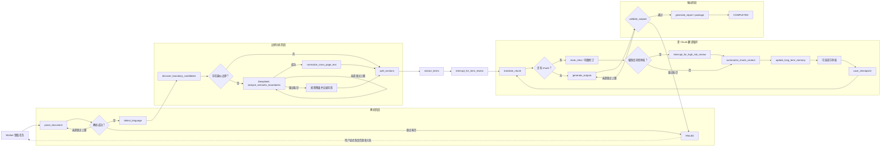

# LongDoc Translator Agent 实施计划

版本：v1.0
日期：2026-06-25
状态：当前实现基线

## 1. 产品目标

用户登录后上传长文档，任务交由独立 Worker 执行。关闭页面、退出登录、断网或 Web 进程重启均不会取消任务；用户稍后重新登录，可以继续术语/风险审核或直接下载已完成结果。

当前阶段包含：简化账号、任务隔离、对象存储、每用户 5 个并发任务、十种目标语言、DeepSeek 疑似边界判断、可读风险和 ETA。embedding 服务与向量数据库不进入当前架构。

## 2. Agent 工作流

`FAILED` 是本次图运行终点，不在图内无限恢复。`POST /api/jobs/{jobId}/resume` 会重新入队并从 PostgreSQL checkpoint 继续。

## 3. 边界与风险规则

- 标题、表格、公式、图片、代码和参考文献是硬结构边界。
- 只有跨页断句、连字符、下一页小写开头、OCR/解析异常等疑点调用 DeepSeek。
- DeepSeek 只返回 `CONTINUE/SPLIT/UNCERTAIN`、置信度和原因，不改写源文。
- 模型失败有限重试后回退规则切分，并生成用户可见风险。
- 高风险不等于任务失败。启用强制审核时 `interrupt`；未启用时完成任务并设置 `hasUnresolvedRisks=true`。
- token hard limit 可以覆盖语义连续判断，但必须留下强制切分风险。

## 4. 系统边界

- FastAPI/Gradio 负责登录、创建任务、查询状态、提交审核和下载。
- Worker 独立执行 LangGraph，不依赖浏览器或 Gradio Session。
- PostgreSQL 保存账号、会话、任务、租约、checkpoint、chunk、术语、指标和风险。
- S3 兼容对象存储保存源文件、DocumentIR、解析资产和输出；本地存储仅用于开发和 Worker 工作目录。
- 每个用户同时最多 5 个租约任务，第 6 个任务排队；PDF 解析可在部署层进一步单独限流。

## 5. 验收与后续

当前验收包括账号隔离、关闭页面后继续、重新登录下载、Worker 重启恢复、五任务并发、跨页语义判断、规则降级、十种目标语言、用户可读风险、ETA 和输出完整性校验。

未来 TODO：翻译版/双语批注 PDF、图片文字分析与导出、预翻译和风格 Prompt、用户选择模型、在线编辑与版本历史、SSE/WebSocket 推送。
